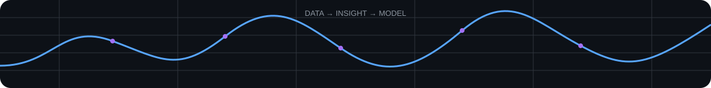

<div align="center">


<br>

[](https://github.com/Skuiri787)
[](https://komarev.com/ghpvc/?username=Skuiri787)
[](https://github.com/Skuiri787?tab=repositories)

</div>



---

## 👨‍💻 About Me

I'm a data-focused learner building my foundation across **data analytics, statistics, and machine learning**.

I enjoy working with real-world datasets, exploring patterns through data, and turning analysis into meaningful insights. My current focus is strengthening my **Machine Learning and Data Science** skills through hands-on projects.

- 🌱 Currently learning **Machine Learning / Data Science**
- 📊 Interested in **Data Analytics, Data Science & AI/ML**
- 🧬 Curious about **Genetics, Computational Biology & Drug Discovery**
- 🧠 Interested in **Neuroscience, Consciousness & Psychology**
- 🔭 Fascinated by **Space Science**
- 📚 I also enjoy exploring **Philosophy & Scientific Thinking**

---

## 🛠️ Tech Stack

### 📊 Data & Analytics

<p>

</p>

**Python · SQL · NumPy · Pandas · Statistics · EDA · Power BI · Microsoft Excel**

### 📈 Visualization

**Matplotlib · Seaborn · Power BI · Excel Dashboards**

### 💻 Tools

<p>

</p>

**Jupyter Notebook · VS Code · GitHub**

---

## 📚 Currently Learning

<div align="center">

```text
MS Excel  →  MySQL  →  Power BI  →  Python  →  EDA  →  Statistics  →  Machine Learning / Data Science
```

</div>

---

## 🚀 Projects

### 🏏 RCB IPL Performance Analysis
**MySQL · SQL · Excel**

Analyzed IPL data to understand RCB's performance gaps and identify data-driven factors behind its lack of an IPL title.

**[View Project →](https://github.com/Skuiri787/rcb_ipl_performance_analysis)**

### 📞 AstroSage Call Center Optimization
**Microsoft Excel · Pivot Tables · Data Analysis**

Analyzed 28,027 call records and developed a ₹1 Crore investment allocation strategy to improve call-center efficiency, customer satisfaction, and revenue performance.

**[View Project →](https://github.com/Skuiri787/Astrosage_Analysis)**

### 🏥 Columbia Asia Hospital Analytics Dashboard
**Power BI · SQL · DAX · Power Query · Excel**

Interactive healthcare analytics project covering hospital revenue, patient visits, waiting time, satisfaction, departments, and doctor performance.

**[View Project →](https://github.com/Skuiri787/Colombia_Asia_Hospital)**

### 🏨 Hotel Booking EDA
**Python · Pandas · NumPy · Matplotlib · Seaborn**

End-to-end exploratory data analysis covering booking patterns, cancellations, customer segments, ADR, lead time, and seasonal trends.

**[View Project →](https://github.com/Skuiri787/Hospital_Booking_Applicationn-eda1)**

### 🐦 Twitter Advertising A/B Testing
**Python · Pandas · SciPy · Statsmodels · Statistical Testing**

Evaluated click-based versus impression-based billing to determine whether impression-based billing reduces advertiser overspending.

**[View Project →](https://github.com/Skuiri787/Twitter_AB_Testing)**

### 📱 Social Media Advertising Analysis & Conversion Prediction
**Python · Pandas · EDA · Machine Learning**

Analyzed social media advertising campaigns and explored campaign performance and conversion-related patterns using data analysis and machine learning.

---

## 🧠 Areas of Interest

<div align="center">

| 🤖 AI & Technology | 🧬 Science & Biology | 🧠 Mind & Behavior | 🌌 Universe |
|:---:|:---:|:---:|:---:|
| Artificial Intelligence | Genetics | Neuroscience | Space Science |
| Machine Learning | Computational Biology | Consciousness | Astronomy |
| Data Science | Drug Discovery | Psychology | Scientific Thinking |
| Data Analytics | Healthcare AI | Philosophy | Exploration |

</div>

---

## 📈 GitHub Activity

<div align="center">


<br><br>


</div>

---

## 🐍 Contribution Activity

<div align="center">

<picture>
  <source media="(prefers-color-scheme: dark)" srcset="https://raw.githubusercontent.com/Skuiri787/Skuiri787/output/github-contribution-grid-snake-dark.svg" />
  <source media="(prefers-color-scheme: light)" srcset="https://raw.githubusercontent.com/Skuiri787/Skuiri787/output/github-contribution-grid-snake.svg" />
  
</picture>

</div>

---

## 🔗 Connect With Me

<div align="center">

[](https://www.linkedin.com/in/shubham-prasad-kuiri-640705194/)
[](https://github.com/Skuiri787)
[](https://www.hackerrank.com/profile/shubhamkuiri787)
[](https://leetcode.com/u/Shubham_kuiri/)

</div>

---

<div align="center">

### ✨ Turning data into insights, and insights into models.

⭐ **Thanks for visiting my profile!**

</div>
